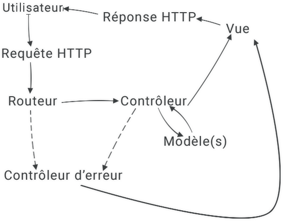
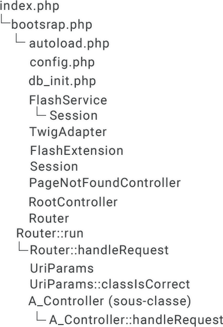

#### GUERIN Ludwig

#### JAOUEN Romain

##### Info 2 Groupe 3

# Mini-projet en PHP : Développement d'un jeu de solitaire

[TOC]

## Préambule

#### Test en serveur local

Afin de tester le fonctionnement de l'application fournie, il est préférable au préalable créer un VirtualHost dont la racine pointe vers le dossier `public_html` afin d'assurer le bon fonctionnementde l'application.

**Attention**, WAMP permet l'accès au VirtualHost via `localhost/application/` ce qui compromet le bon fonctionnement de l'application, pour éviter ce problème accéder directement à `application/`.

**<u>NB</u>**

Par la suite, nous utiliserons `application` pour représenter le chemin menant au dossier `public_html`.

Afin de faciliter la mise en place d'un VirtualHost, le fichier `VirtualHost.txt` est fourni indiquant les paramètres nécessaires pour le fonctionnement correct du VirtualHost (modifier les chemins pour faire pointer vers le dossier `public_html` de cette application).

**<u>Attention</u>**

Cette application se basait sur `$_SERVER['REQUEST_URI']` pour la répatition des URL, il fallait **impérativement** que la racine du serveur soit le dossier `public_html` (via VirtualHost).

Étant donnée la présence d'une consigne supplémentaire à l'emplacement de l'envoi des fichiers de ce projet, ce comportement a été modifié pour pouvoir utiliser l'application depuis n'importe quel nom d'hôte.

Il faut cependant bien modifier le fichier `config.php` afin de prendre en compte l'URL de la racine (l'URL menant vers le dossier `public_html`, e.g. `http://localhost/info2s3/projet/public_html`, `http://application`).

#### Dépendances

Cette application est conçue pour fonctionner sur un serveur Apache (2.0) avec PHP 7.1.* (pseudo-typage de retour et amélioration du pseudo-typage des paramètres de fonctions/méthodes et divers correction de problèmes de sécurité) ainsi que MySQL (version >=5.7.14, possibles version inférieures).

Il y a également deux dépendances optionnelles, à savoir [NodeJS](https://nodejs.org/en/download/) (pour npm) et [composer](https://getcomposer.org/download/).

Afin de faciliter la mise en place de ces dépendances, les dernières versions de [WAMP](http://wampserver.aviatechno.net/), [XAMPP](https://www.apachefriends.org/fr/index.html) permettent d'obtenir des versions de PHP, Apache et MySQL suffisantes (sous Linux, les paquets s'installent un par un via apt-get).

De surcroit WAMP propose un utilitaire de création de VirtualHost afin de faciliter la tâche précédente.

**<u>NB</u>**

Sauf changements de dernière minutes, une version alternative pour PHP>=5.6.25 sera proposée (compatibilité inférieure non garanties).

#### Mise à jour des dépendances de développement (optionnel)

Cette étape est censée être optionnelle, les dépendanes étant mises à jour régulièrement, cependant cela peut être intéressant de les mettre à jour manuellement afin de s'assurer d'avoir les dernières versions des diverses bibliothèques utilisées.

Afin de mettre à jour toutes les dépendances de développement (diverses bibliothèques) il faut :

* Se munir d'un terminal compatible avec les commandes d'un bash linux classique
* Se rendre dans le dossier `dev`  (et non `dev..`)
* Exécuter `npm run bulk`, cela mettra à jour les dépendances javascript et CSS
* Une fois fini, exécuter `cd ..`
* Enfin exécuter `composer update` puis `composer dump-autoload` ce qui mettra à jour les dépendances PHP et regénérera l'autoloader

#### Mise en place de la base de données

Afin de bien mettre en place la base de données, il faut se reporter au fichier de configuration correspondant (`dev/config.php`) et apporter les modifications  souhaitées (nom de DB, nom d'hôte, nom d'utilisateur, mot de passe, etc ...) puis créer la base de données en conséquence.

Un script SQL est à votre disposition pour la création des tables et l'insertion de tuples par défaut : `dev/exec.sql` (ces tuples par défaut étant ceux donnés, à savoir toto#toto et titi#titi où username#password)

Des logiciels tels que [SQLyog](https://github.com/webyog/sqlyog-community/wiki/Downloads) (ou encore phpMyAdmin) proposent une exécution de script afin de faciliter cette étape.

## Respect du modèle MVC

Cette application, comme demandé, respecte une architecture suivant le modèle MVC (le fonctionnement type de l'application sera décrit plus tard).

### Modèles

> constructeur(
>
>   Project\Helpers\Database\DBConnection connection,
>
>   string nomDeTable
>
> )

Les **modèles** sont représentés par des classes étant sous-classes de la classe abstraite `Project\Models\A_Model`. Ces derniers, à l'aide d'une connexion à la base de données (établie à la construction de l'objet), proposent des méthodes facilitant le traitement et l'acquisition de données (e.g. savoir si un nom d'utilisateur est déjà pris).

### Contrôleurs

> constructeur(
>
>   Project\Helpers\Rendering\I_ViewRenderEngine moteur,
>
>   Project\Helpers\Database\DBConnection connection
>
> )

Les **contrôleurs** sont représentés par des classes étant sous-classes de la classe abstraite `Project\Controllers\A_Controller`. Ces derniers, à l'aide d'une connexion à la base de données (établie à la construction de l'objet) ainsi que d'un moteur de rendu de vues (également établi à la construction de l'objet) exposent des méthodes publiques qui seront appelées par le routeur afin d'effectuer le traitement des données et le rendu et affichage de la vue.

### Vues

> constructeur(void)

Le système de **vues** de cette application est fait en deux étapes :

1. Un appel à(aux) méthode(s) de rendu de vue est effectué
2. La **vue** est rendue puis affichée

Un **moteur de rendu de vue** est une classe implémentant l'interface `Project\Helpers\Rendering\I_ViewRenderEngine`. Ce dernier va, à partir d'un chemin relatif menant au fichier contenant la vue et d'un tableau associatif de données, effectuer un rendu paramétrique de la vue (car présence de données).

Il est également possible de définir des données globales (qui ne seront pas à re-préciser à chaque rendu), par exemple le status du drapeau de *debug*.

### Routeur

> constructeur(
>
>   Project\Helpers\Rendering\I_ViewRenderEngine moteur,
>
>   Project\Controllers\A_ErrorController controleur404,
>
>   Project\Controllers\A_Controller controleurParDefaut,
>
>   Project\Helpers\Database\DBConnection connection
>
> )

Le **routeur** est le coeur de cette application : il va, à partir d'une requête HTTP, redistribuer la requête au contrôleur concerné tout en appelant la méthode demandée ainsi que les éventuels paramètres additionnels qui pourraient avoir été donnés par l'utilisateur.

Afin de vulgariser ces propos, voici un exemple:

Un requête utilisant la méthode GET pour l'URL `http://application/api/stats/toto` va être décomposée de la façon suivante :

1. Récupération du fragment d'URI (ici, `/api/stats/toto`)
2. * Si le fragment d'URI est `'/'` alors le contrôleur concerné est celui par défaut (ce n'est pas la cas ici)
   * Sinon, on décompose l'URI en un tableau (ici `['api', 'stats', 'toto']`) et on observe le premier élément
     1. Nous transformons le premier élément de la façon suivante : `'api'` => `'Project\Controllers\ApiController'`
     2. * Nous regardons si la classe (cf. ci-dessus) existe et si cette dernière n'est pas sous-classe du contrôleur par défaut, si c'est le cas alors on instancie cette classe (avec une référence au moteur de rendu de vue ainsi qu'une référence à la connexion à la base de données) et ce sera le contrôleur concerné
        * Sinon, le contrôleur concerné est le contrôleur d'erreur 404 (cf. composition du constructeur du routeur)
3. Nous appelons la méthode `handleRequest` sur le contôleur concerné en lui passant en paramètre un `Project\Helpers\Http\Request` ainsi qu'une référence à ce **routeur**
4. * Si la méthode de la requête est GET, alors la méthode `handleGetRequest` sera appelée sur ce même contrôleur (avec les même paramètres)
   * Si la méthode de la requête est POST, alors la méthode `handlePostRequest` sera appelée sur ce même contrôleur (avec les même paramètres)
   * Sinon un appel à la méthode de rendu de vue du contrôleur d'erreur est effectué (`Project\Controllers\A_ErrorController::renderView`, `Project\Helpers\Routing\Router::getError404Controller`)   **[FIN DE TRAITEMENT]**
5. * Si un appel à la méthode (ici `stats`) est possible (méthode en `public`) alors l'appel est effectué en passant en paramètre, dans l'ordre : le moteur de rendu de vue, la requête, les paramètres additionnels de la requête (un à un) ; (ici `Project\Controllers\ApiController::stats`)
   * Sinon un appel à la méthode de rendu de vue du contrôleur d'erreur est effectué (`Project\Controllers\A_ErrorController::renderView`, `Project\Helpers\Routing\Router::getError404Controller`)   **[FIN DE TRAITEMENT]**
6. Après les divers traitements effectués par la méthode appelée, un rendu de vue sera fait (ou une redirection) **[FIN DE TRAITEMENT]**

Ce **routeur** se base sur la réécriture classique d'une URL (cf. `public_html/.htaccess`).

## Écarts minimes de consignes

### Architecture de dossiers/scripts

Contrairement à ce qui était indiqué, cette application se décompose en deux grandes parties :

* dev
* public_html

Le dossier `public_html` contient tout ce qui est accessible au public (`index.php`, feuilles de styles, scripts, polices de caractères, images, etc...) tandis que le dossier `dev` comporte tous les composants non destinés au public (configuration contenant les informations relatives à la base de données, données sensibles de configuration, etc...).

#### dev

Le répertoire `dev` est contruit de la manière suivante:

* **config**  &rarr;  contient les fichiers de configuration de l'application (pour le développement, pour la production, ce fonctionnement a été abandonné au profit de la mise en place d'un unique `config.php`)
* **controllers** &rarr;  contient tous les contrôleurs
* **helpers**  &rarr;  contient énormément de classes subsidiaires facilitant le traitement des divers données
* **js** &rarr;  contient tous les fichiers javascripts utilisés (validation de formulaires, messages d'erreur "dynamiques", icône de chargement, etc...)
* **models** &rarr;  contient tous les modèles
* **node_modules** &rarr;  contient toutes les dépendances javascript
* **views** &rarr;  contient toutes les vues
* *.babelrc* &rarr;  fichier de configuration pour Babel (transpiler pour javascript)
* *.htaccess* &rarr;  fichier de configuration apache interdisant l'accès externe aux fichiers
* *bootstrap.php* &rarr;  Se charge de la configuration et de la mise en place de l'application (utilise *config.php* et *db_init.php*)
* *config.php* &rarr;  Charge la configuration adéquat (en fonction du drapeau de debug)
* *db_init.php* &rarr;  Se charge d'établir la connexion à la base de données
* *exec.sql* &rarr;  fichier facilitant la mise en place de la base de données
* *package.json* &rarr;  fichier de configuration des dépendances javascript
* *webpack.config.js* &rarr;  fichier de configuration de webpack (pour javascript)

#### public_html

Le répertoire `public_html` est construit de la manière suivante:

* **assets** &rarr;  contient l'ensemble des ressources publiques utilisées par l'application (js, css, images, etc...)
* *.htaccess* &rarr;  fichier de configuration apache pour la réécriture d'URL
* *index.php* &rarr;  point d'entrée de l'application (utilise `../dev/bootstrap.php`) démarrant cette dernière

### Bibliothèques externes et technologies

Bien que non contre-indiqué dans les consignes (ou dans les éclaircissements apportés sur ces dernières), nous avons tenté de limiter l'usage de bibliothèques externes à un minimum.

Nous utilisons donc seulement une bibliothèque externe (et un outil de développement), à savoir :

* Twig &rarr; Moteur de rendu de vues
* Composer &rarr; outil de développement en PHP : gestionnaire de paquets/bibliothèques

#### Twig

Bien que le rendu de vues en PHP pur ne soit pas impossible, il est cependant très lourd et excessivement redondant.

Pour illustrer ce propos je vous invite à vous rendre, une fois connecté, sur les URL suivantes :

* `http://application/game/play` (en mode debug, afin d'avoir accès à la défaite/victoire instantannée) puis perdre/gagner pour aller en `http://application/game/end`
* `http://application/nativeRenderEngine/test`

Le résultat visuel (page HTML émise) est strictement identique, en revanche il n'en va pas de même pour le code :

* `http://application/nativeRenderEngine/test` utilise `Project\Helpers\Rendering\NativeRenderEngine` qui permet d'écrire ses vues en PHP pur
* `http://application/game/end`  utilise `Project\Helpers\Rendering\TwigAdapter` qui permet d'utiliser Twig pour les vues

Là où du PHP pur et Twig diffèrent est le fait que Twig propose un système de modularisation des vues via un système de blocs (et d'héritage/surchagre/redéfinition de blocs).

Cela permet donc de factoriser le code commun à toutes les pages en modules séparées et d'uniquement faire un assemblage dans la vue finale.

Pour la comparaison, ouvrir les fichiers `dev/views/game/end.twig` et `dev/views/nativeRenderEngine/end.php` permet de se rendre compte que, sans modularisation des vues (et donc réutilisation des blocs) la vue devient très (voire trop) fournie et perd donc cette focalisation sur le caractère spécifique de la vue.

De surcroît, Twig ne gêne en rien l'accomplissement de la mise en place d'un modèle MVC, au contraire il le facilite.

#### Composer

Plus discutable que Twig, Composer n'est utilisé que pour deux finalités précises :

* fournir un fichier `vendor/autoload.php` (cf. [PSR 4](http://www.php-fig.org/psr/psr-4/)) qui permet en un seul `require_once` d'inclure toutes les classes définies (il faut cependant passer par un fichier de configuration pour les classes qui ne viennent pas de bibliothèques, à savoir `composer.json`) et permet d'apporter une plus grande importance à l'utilisation de namespace
* permettre d'installer des bibliothèques externes PHP très facilement

S'agissant d'un outil général (non spécifique à un design pattern ou paradigme quelconque) et n'étant qu'un outil facilitant le développement d'application PHP, nous nous sommes permis de l'utiliser.

#### Javascript

L'utilisation de javascript (ne portant pas atteinte au déroulement du jeu) n'est là que pour tenter d'améliorer l'expérience utilisateur avec un bandeau de notification et une icône de chargement et de la validation côté client.

#### PHP &ge; 7.1.0

PHP est un langage très utilisé de nos jours, et étant un langage côté serveur, il est donc **INDISPENSABLE** de se procurer les versions les plus récentes :

* ces dernières ajoutent des fonctionnalités très intéressantes en terme de langage (ici le pseudo-typage du retour des fonctions/méthodes)
* ces dernières apportent des corrections de failles de sécurité
* ces dernières apportent des améliorations en terme d'outils de sécurité (API de hash : password_hash, password_verify)

De surcroît cela permet d'adapter la demande tout en respectant les standards en vigueurs (ici `password_hash` et `password_verify` sont compatibles avec l'utilisation de `crypt` faite pour les comptes toto et titi).

Cependant, à moins d'un malencontreux changement de dernière minute, une version compatible PHP&ge;5.6.25 sera proposée en alternative (une traduction directe du code, avec la sécurité du pseudo-typage et du salage généré aléatoirement en moins).

**<u>NB</u>**

Les versions 7.2.* de PHP n'apportant que peu de nouveautés intéressantes, celles-ci sont donc laissées de côté au profit des version 7.1.* .

### Autres écarts divers

#### Début de partie

Le commencement de la partie (où le joueur était supposé choisir le premier pion à enlever) a été troqué pour un plateau de début classique du solitaire (cf. [wikipedia, plateau 2](https://fr.wikipedia.org/wiki/Solitaire_(casse-t%C3%AAte)#Types_de_plateaux)). À noter que ce changement n'est que peu impactant : la logique, le traitement de données et les vues étant totalement séparées il serait aisé d'implémenter cette fonctionnalité (qui semblait au départ curieuse).

#### Configuration

Bien que la consigne ait été respectée (divers constantes servant à la configuration), il est important de se rendre compte que l'utilisation d'un tableau de configuration semble plus judicieuse et adaptée (l'est encore plus si l'on ajoute un principe d'accès via [dot-notation](https://github.com/adbario/php-dot-notation#examples)).

En effet, ce système permet de regrouper en unités solidaires et logiques les données de configuration qui interagissent au même niveau (e.g. url de DB, nom de DB, etc...).

#### Vues d'erreur

Le principe de vue d'erreur proposé par l'énoncé a été troqué pour un principe de messages flash en session qui, en plus d'offrir une expérience utilisateur accrue, semble bien plus cohérent et semble bien moins rompre la logique de l'enchaînement des vues.

## Fonctionnement global de l'application

Le schéma ci-dessus représente le fonctionnement global de l'application.

Le schéma ci-dessous représente l'enchaînement des scripts utilisés (et variables, et appels de méthodes) pour traiter la requête HTTP (de haut en bas)

Pour plus de détails, se reporter à la partie concernant le fonctionnement du routeur.

## Techniques Utilisées

### Session

Énormément de paramètres ayant besoin d'être partagés à travers l'application, il semble impossible (sans conteneur/gestionnaire de dépendances) de gérer toutes ces dépendances continuellement.

C'est pour cela que nous avons opté pour la transmission de données clées via session.

### Flash

Les messages flash sont des messages qui ne sont stockés en session que pour une transaction (requête, réponse) HTTP (bien que restent si non utilisés).

Ces messages sont donc particulièrements adaptés pour avertir l'utilisateur d'éventuelles erreurs non prévisibles côté client (e.g. mouvement impossible).

Ainsi nous avons préféré, pour des erreurs non relatives à la validation de formulaires (e.g. nom d'utilisateur déjà pris n'utilise pas de message flash), l'utilisation de messages flash à une vue séparée.

Il est important de noter que nous avons utilisé [jq-flash](https://www.npmjs.com/package/jq-flash) pour l'affichage des messages flash côté client.

### Messages d'erreur de validation venant de la validation côté serveur

Le rendu des vues étant paramétrique, il nous ait tout à fait possible de passer des messages d'erreur relatifs aux champs de formulaires aux vues.

C'est donc l'approche que nous avons privilégié :

Si il y a une erreur de validation côté serveur, alors les données valides sont renvoyées et des messages d'erreurs sont également envoyés.

Cela permet à l'utilisateur de ne pas avoir à re-taper les informations qui étaient au préalable valides tout en l'informant des informations erronées.

### Graphe et statistiques

Nous avons, pour les statistiques du joueur, décidé d'utiliser une bibliothèque javascript [highcharts](https://www.npmjs.com/package/highcharts) car cela nous permet d'avoir un aperçu rapide des statistiques, en plus des statistiques écrites supplémentaires.

### Passage des paramètres de page en page

La plupart des traitements ne nécessitant pas (ou peu) de transitions vers d'autres pages, nous n'avons pas utilisé de méthode précise pour la passage de paramètres de page en page (session, pas d'URL longues, pas de champs cachés) : en effet, la plupart des traitements s'effectuent sur une page, et ceux nécessitant plusieurs pages vont généralement chercher les données nécessaires en infomations de session.

### Système de routing

Afin de faciliter le développement, tout en gardant une cohérence dans le comportement partagé par les contrôleurs, nous avons opté pour un système de routing similaire à celui de CodeIgniter passant donc par la définition préalable de toutes les classes puis répartissant en fonction d'une décomposition algorithmique de l'URI.

Ce système permet de mettre en place rapidement un groupe de fonctionnalités mais a également ses limites :

`/user` est impossible à faire sans rajouter d'autres contraintes de comportement aux contrôleurs

`/user/nom` (méthode, argument) est impossible à distringuer de `user/nom` (contrôleur, méthode).

En effet, là où il y a une couplage Route[\*-1]Contrôleur, un système dit  *MVRA* (dérivé de MVC : Model View Route Action) aura un couplage Route[1-1]Action ce qui semble bien plus intéressant dans une optique de modularisation de l'application (chaque unité fait une seule chose, mais elle la fait bien).

### Sécurité des mots de passe

Bien que la fonction `crypt` ait été proposée, nous avons choisi d'utiliser les API de hash les plus récentes (`password_hash` et `password_verify`), car les plus adaptées en terme de sécurité vis-à-vis des besoins en sécurité actuels.

De surcroît, les hash générés sont compatibles avec ceux de `crypt`.